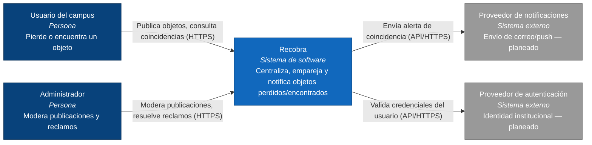

# C4-C1: Diagrama de Contexto — Recobra

Muestra a Recobra como una caja única y quiénes interactúan con ella: los
usuarios del campus, el administrador y los sistemas externos planeados
(notificaciones, autenticación).

**Leyenda:** azul oscuro = persona · azul = sistema Recobra · gris = sistema externo.
Las etiquetas de las flechas indican la acción y el protocolo.
Notificaciones y autenticación están en el contexto objetivo; el corte 1 aún no
los implementa en código (ver [`docs/context-map.md`](../context-map.md) para
el detalle de contextos delimitados).
