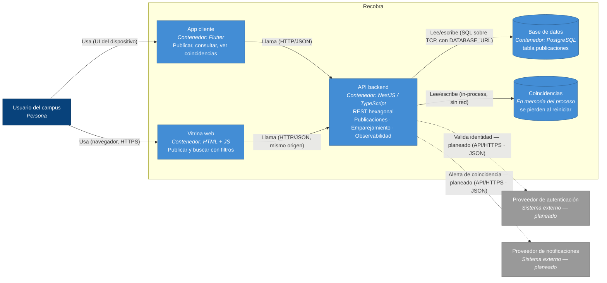

# C4-C2: Diagrama de Contenedores — Recobra

Hace zoom sobre el sistema Recobra del [C4-C1](C4-C1.md) y muestra sus
contenedores desplegables y el estado real de cada uno en el código.

Actualizado para el segundo corte (S10): refleja PostgreSQL activo,
Emparejamiento y búsqueda implementados, la vitrina web y el despliegue en
Dokploy. Lo que sigue siendo planeado se marca como tal.

| Contenedor | Estado en código | Notas |
|------------|------------------|-------|
| App cliente Flutter | Implementado | `mobile/` — crear, consultar y ver coincidencias |
| Vitrina web | Implementado | `public/index.html`, servida por la propia API; publicar, buscar con filtros y ver coincidencias |
| API backend NestJS | Implementado | Publicaciones (`POST/GET /publicaciones`, búsqueda con filtros), Emparejamiento (`GET /coincidencias`), `/health` y `/metrics` |
| PostgreSQL | Implementado | `PostgresPublicacionRepository` se activa con `DATABASE_URL`; sin ella la API usa memoria ([ADR-0006](../adr/0006-plataforma-persistencia-postgresql.md)) |
| Coincidencias | Implementado en memoria | `MemoriaCoincidenciaRepository`: se pierden al reiniciar la API; pendiente de persistir |
| Notificaciones / Auth | Planeado | Aparecen en C4-C1; aún no son contenedores con código |

```mermaid
flowchart LR
    usuario["Usuario del campus<br/><i>Persona</i>"]
    auth["Proveedor de autenticación<br/><i>Sistema externo — planeado</i>"]
    notif["Proveedor de notificaciones<br/><i>Sistema externo — planeado</i>"]

    subgraph recobra["Recobra"]
        direction LR
        app["App cliente<br/><i>Contenedor: Flutter</i><br/>Publicar, consultar, ver coincidencias"]
        web["Vitrina web<br/><i>Contenedor: HTML + JS</i><br/>Publicar y buscar con filtros"]
        api["API backend<br/><i>Contenedor: NestJS / TypeScript</i><br/>REST hexagonal<br/>Publicaciones · Emparejamiento · Observabilidad"]
        bd[("Base de datos<br/><i>Contenedor: PostgreSQL</i><br/>tabla publicaciones")]
        mem[("Coincidencias<br/><i>En memoria del proceso</i><br/>se pierden al reiniciar")]
    end

    usuario -->|"Usa (UI del dispositivo)"| app
    usuario -->|"Usa (navegador, HTTPS)"| web
    app -->|"Llama (HTTP/JSON)"| api
    web -->|"Llama (HTTP/JSON, mismo origen)"| api
    api -->|"Lee/escribe (SQL sobre TCP, con DATABASE_URL)"| bd
    api -->|"Lee/escribe (in-process, sin red)"| mem
    api -.->|"Valida identidad — planeado (API/HTTPS · JSON)"| auth
    api -.->|"Alerta de coincidencia — planeado (API/HTTPS · JSON)"| notif

    classDef persona fill:#08427b,color:#fff,stroke:#052e56;
    classDef contenedor fill:#438dd5,color:#fff,stroke:#2e6295;
    classDef externo fill:#999999,color:#fff,stroke:#6b6b6b;

    class usuario persona;
    class app,web,api,bd,mem contenedor;
    class notif,auth externo;
```

**Leyenda:** azul oscuro = persona · azul claro = contenedor · gris = externo.
Flechas discontinuas = relaciones planeadas aún no cableadas.

## Despliegue

La API se empaqueta con el [`Dockerfile`](../../Dockerfile) y se despliega en
Dokploy mediante [`deploy/compose.lab.yaml`](../../deploy/compose.lab.yaml);
el detalle del entorno está en la
[sección 7 de arc42](../arc42/arc42.md#7-vista-de-despliegue). Render dejó de
usarse (ver el ADR de migración a Dokploy en `docs/adr/`).

Decisiones: [ADR-0002](../adr/0002-arquitectura-y-stack.md),
[ADR-0003](../adr/0003-reto-corte1-stack-obligatorio.md),
[ADR-0004](../adr/0004-integracion-sincrona-vs-asincrona.md),
[ADR-0006](../adr/0006-plataforma-persistencia-postgresql.md),
[ADR-0008](../adr/0008-busqueda-con-filtros-en-el-repositorio.md).
