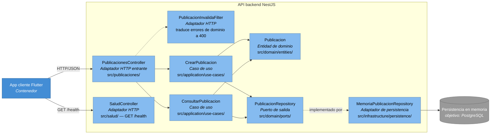

# C4-C3: Diagrama de Componentes — API Recobra

Hace zoom sobre el contenedor **API backend (NestJS)** del [C4-C2](C4-C2.md),
mostrando los componentes internos que implementan la arquitectura hexagonal
(dominio, aplicación, adaptadores) descrita en
[`docs/arc42/arc42.md`](../arc42/arc42.md#5-bloques-de-construcción).

**Leyenda:** azul (contenedor) = App cliente Flutter, fuera del zoom · azul claro
= componente dentro de la API · gris = almacén de datos. Flecha punteada =
relación de implementación de puerto/adaptador, no de llamada directa.

Cada componente corresponde a un bloque de la sección 5 de
[`docs/arc42/arc42.md`](../arc42/arc42.md#5-bloques-de-construcción); la
propiedad de los datos que maneja `PublicacionRepository` está detallada en
[`docs/modulo-datos.md`](../modulo-datos.md).
