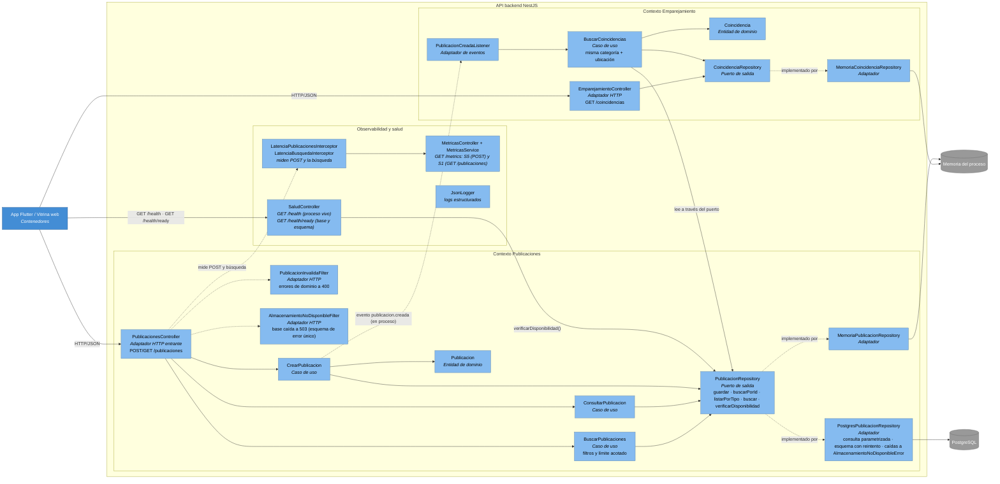

# C4-C3: Diagrama de Componentes — API Recobra

Hace zoom sobre el contenedor **API backend (NestJS)** del [C4-C2](C4-C2.md),
mostrando los componentes internos que implementan la arquitectura hexagonal
(dominio, aplicación, adaptadores) descrita en
[`docs/arc42/arc42.md`](../arc42/arc42.md#5-bloques-de-construcción).

Actualizado para el segundo corte (S10): incluye la búsqueda con filtros, el
contexto de Emparejamiento, la observabilidad y el adaptador PostgreSQL.

```mermaid
flowchart LR
    cliente["App Flutter / Vitrina web<br/><i>Contenedores</i>"]

    subgraph api["API backend NestJS"]
        direction LR

        subgraph pub["Contexto Publicaciones"]
            controller["PublicacionesController<br/><i>Adaptador HTTP entrante</i><br/>POST/GET /publicaciones"]
            filtro["PublicacionInvalidaFilter<br/><i>Adaptador HTTP</i><br/>errores de dominio a 400"]
            filtro503["AlmacenamientoNoDisponibleFilter<br/><i>Adaptador HTTP</i><br/>base caída a 503 (esquema de error único)"]
            crear["CrearPublicacion<br/><i>Caso de uso</i>"]
            consultar["ConsultarPublicacion<br/><i>Caso de uso</i>"]
            buscar["BuscarPublicaciones<br/><i>Caso de uso</i><br/>filtros y límite acotado"]
            entidad["Publicacion<br/><i>Entidad de dominio</i>"]
            puerto["PublicacionRepository<br/><i>Puerto de salida</i><br/>guardar · buscarPorId · listarPorTipo · buscar · verificarDisponibilidad"]
            memoria["MemoriaPublicacionRepository<br/><i>Adaptador</i>"]
            pg["PostgresPublicacionRepository<br/><i>Adaptador</i><br/>consulta parametrizada · esquema con reintento · caídas a AlmacenamientoNoDisponibleError"]
        end

        subgraph emp["Contexto Emparejamiento"]
            listener["PublicacionCreadaListener<br/><i>Adaptador de eventos</i>"]
            coinc["BuscarCoincidencias<br/><i>Caso de uso</i><br/>misma categoría + ubicación"]
            ecoinc["Coincidencia<br/><i>Entidad de dominio</i>"]
            pcoinc["CoincidenciaRepository<br/><i>Puerto de salida</i>"]
            mcoinc["MemoriaCoincidenciaRepository<br/><i>Adaptador</i>"]
            econtroller["EmparejamientoController<br/><i>Adaptador HTTP</i><br/>GET /coincidencias"]
        end

        subgraph obs["Observabilidad y salud"]
            salud["SaludController<br/><i>GET /health (proceso vivo)<br/>GET /health/ready (base y esquema)</i>"]
            metricas["MetricasController + MetricasService<br/><i>GET /metrics: S5 (POST) y S1 (GET /publicaciones)</i>"]
            interceptores["LatenciaPublicacionesInterceptor<br/>LatenciaBusquedaInterceptor<br/><i>miden POST y la búsqueda</i>"]
            logger["JsonLogger<br/><i>logs estructurados</i>"]
        end
    end

    bd[("PostgreSQL")]
    mem[("Memoria del proceso")]

    cliente -->|"HTTP/JSON"| controller
    cliente -->|"HTTP/JSON"| econtroller
    cliente -->|"GET /health · GET /health/ready"| salud
    salud -->|"verificarDisponibilidad()"| puerto
    controller --> crear
    controller --> consultar
    controller --> buscar
    controller -.-> filtro
    controller -.-> filtro503
    crear --> entidad
    crear --> puerto
    consultar --> puerto
    buscar --> puerto
    puerto -.->|"implementado por"| memoria
    puerto -.->|"implementado por"| pg
    pg --> bd
    memoria --> mem
    crear -.->|"evento publicacion.creada (en proceso)"| listener
    listener --> coinc
    coinc --> ecoinc
    coinc -->|"lee a través del puerto"| puerto
    coinc --> pcoinc
    pcoinc -.->|"implementado por"| mcoinc
    mcoinc --> mem
    econtroller --> pcoinc
    controller -.->|"mide POST y búsqueda"| interceptores
    interceptores --> metricas

    classDef contenedor fill:#438dd5,color:#fff,stroke:#2e6295;
    classDef componente fill:#85bbf0,color:#000,stroke:#5d82a8;
    classDef almacen fill:#999999,color:#fff,stroke:#6b6b6b;

    class cliente contenedor;
    class controller,filtro,filtro503,interceptores,crear,consultar,buscar,entidad,puerto,memoria,pg,listener,coinc,ecoinc,pcoinc,mcoinc,econtroller,salud,metricas,logger componente;
    class bd,mem almacen;
```

**Leyenda:** azul = contenedor fuera del zoom · azul claro = componente dentro
de la API · gris = almacén de datos. Flecha punteada = implementación de
puerto o evento, no llamada directa.

**Regla de dueño de datos:** Emparejamiento nunca escribe sobre la tabla de
publicaciones; solo la lee a través del puerto `PublicacionRepository` (ver
[`docs/modulo-datos.md`](../modulo-datos.md) y la auditoría en
[`docs/auditoria-generacion-ia.md`](../auditoria-generacion-ia.md)).

Cada componente corresponde a un bloque de la sección 5 de
[`docs/arc42/arc42.md`](../arc42/arc42.md#5-bloques-de-construcción).
