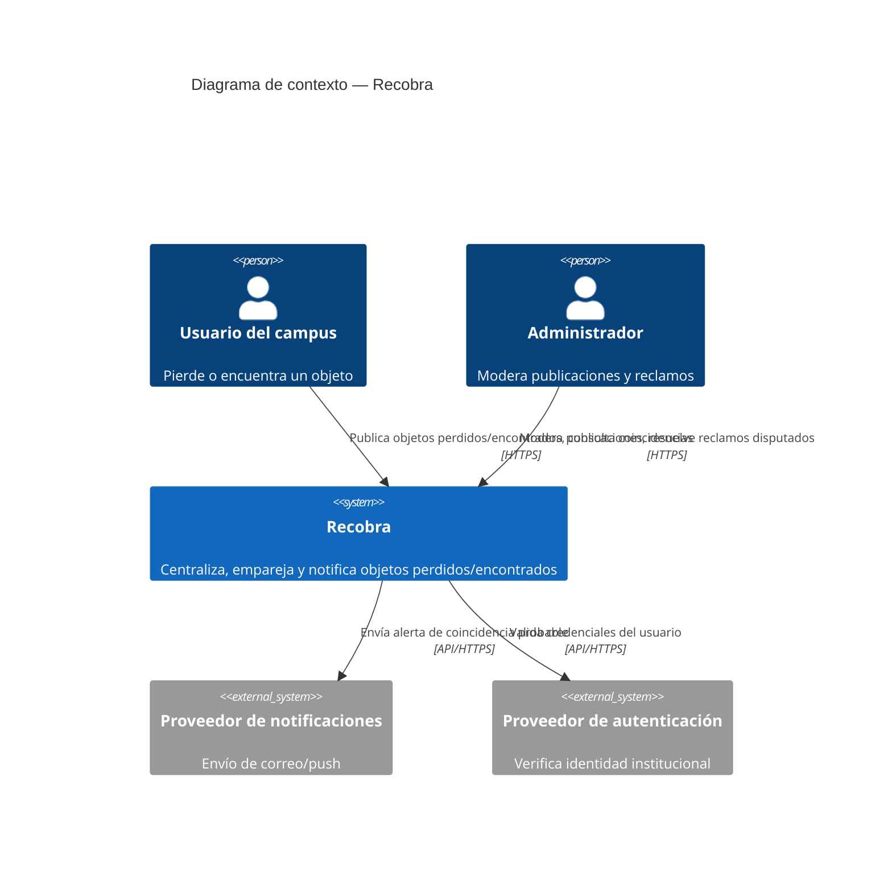
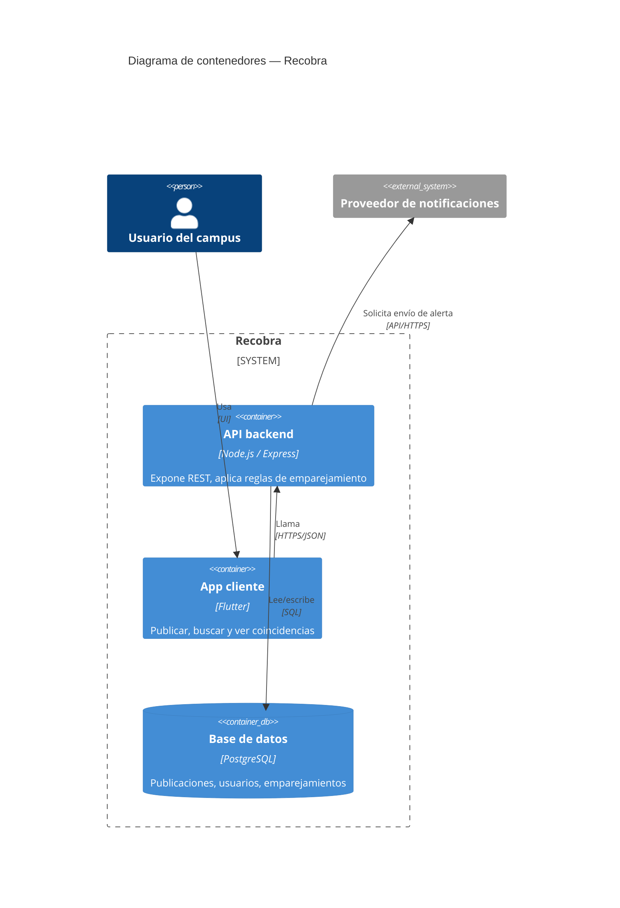

# C4 — Recobra

Reemplaza `docs/C4.md` (texto plano) por diagramas como código. GitHub
renderiza Mermaid automáticamente en la vista del `.md`. Ajusta actores,
sistemas y flechas a la realidad del proyecto; esto es un punto de partida
con leyenda y flechas etiquetadas, tal como pide la retroalimentación.

## Nivel 1 — Diagrama de contexto

## Nivel 2 — Diagrama de contenedores

> Ajusten actores, sistemas externos y verbos de las flechas a lo que
> realmente hace su MVP; lo importante es que quede como código versionable
> (Mermaid), con leyenda de qué representa cada rectángulo y flechas
> etiquetadas con el protocolo/acción, no como texto narrativo.
