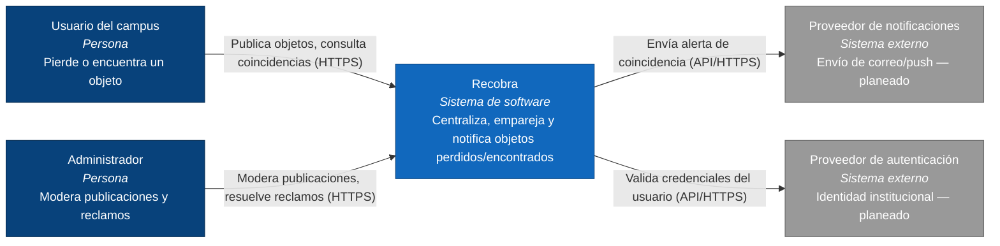
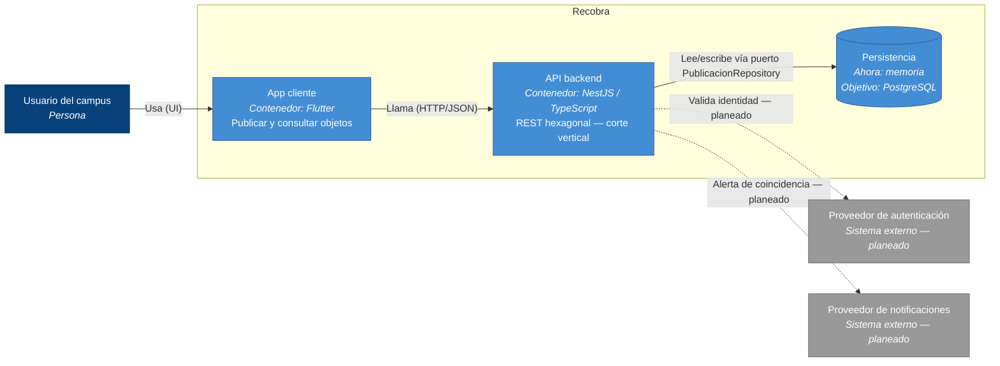

# C4 - Recobra

## Nivel 1 — Diagrama de contexto

**Leyenda:** azul oscuro = persona · azul = sistema Recobra · gris = sistema externo.
Las etiquetas de las flechas indican la acción y el protocolo.
Notificaciones y autenticación están en el contexto objetivo; el corte 1 aún no
los implementa en código.

## Nivel 2 — Diagrama de contenedores

Alcance **actual del corte 1** vs **objetivo**:

| Contenedor | Estado en código | Notas |
|------------|------------------|-------|
| App cliente Flutter | Implementado (mínimo) | `mobile/` — crear/consultar publicación |
| API backend NestJS | Implementado | Corte vertical crear/consultar + `/health` |
| Persistencia en memoria | Implementado (adaptador temporal) | Puerto `PublicacionRepository` |
| PostgreSQL | Planeado | Sustituye el adaptador en memoria sin tocar dominio |
| Notificaciones / Auth | Planeado | Aparecen en nivel 1; aún no son contenedores con código |

**Leyenda:** azul oscuro = persona · azul claro = contenedor · gris = externo.
Flechas discontinuas = relaciones planeadas aún no cableadas en el corte 1.
Decisiones: [ADR-0002](../adr/0002-arquitectura-y-stack.md),
[ADR-0003](../adr/0003-reto-corte1-stack-obligatorio.md).
