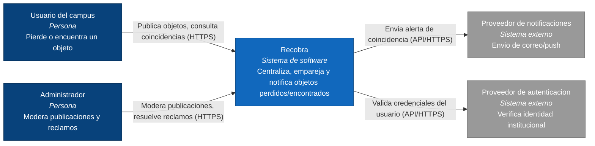
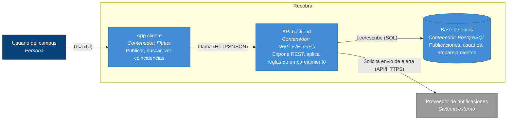

# C4 - Recobra

## Nivel 1 — Diagrama de contexto

**Leyenda:** azul oscuro = persona · azul = sistema Recobra · gris = sistema externo. Las etiquetas de las flechas indican la accion y el protocolo.

## Nivel 2 — Diagrama de contenedores

**Leyenda:** azul oscuro = persona · azul claro = contenedor dentro de Recobra · gris = sistema externo. El cilindro representa la base de datos.
