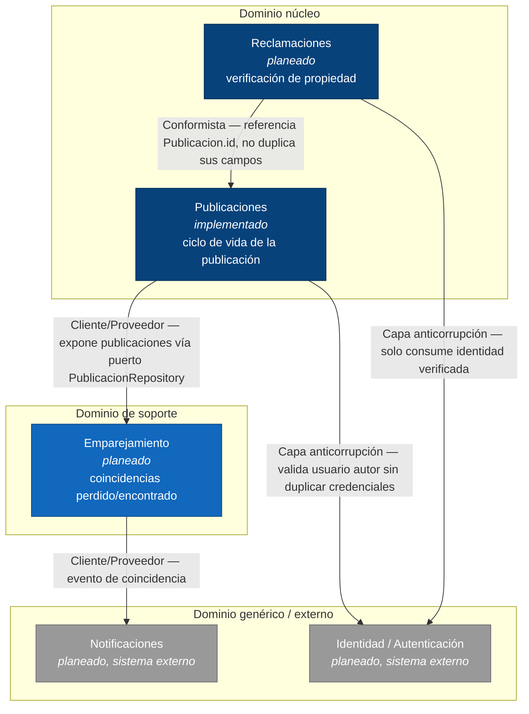

# Mapa de contextos delimitados (Bounded Context Map) — Recobra

Contextos derivados del dominio descrito en el [README](../README.md), el
[C4 nivel 1](c4/C4-C1.md) y los [escenarios de calidad](calidad/escenarios_calidad.md).
Solo **Publicaciones** tiene código implementado en el corte 1; el resto está
documentado como objetivo para que las fronteras de datos queden decididas
antes de escribirlos (evita que dos módulos futuros terminen leyendo/escribiendo
la misma tabla).

## Diagrama

**Leyenda:** azul oscuro = dominio núcleo (donde está la ventaja competitiva del
proyecto) · azul claro = dominio de soporte · gris = genérico o externo, con
patrón de integración *Capa anticorrupción* porque Recobra no controla su
modelo de datos.

## Contextos y su rol

| Contexto | Tipo (DDD) | Rol en el negocio | Estado |
|---|---|---|---|
| **Publicaciones** | Núcleo | Registrar y consultar objetos perdidos/encontrados; dueño del ciclo de vida `publicado → en contacto → reclamado/cerrado` | Implementado (`src/domain`, `src/application`, `src/publicaciones`) |
| **Reclamaciones** | Núcleo | Verificar que quien reclama un objeto tiene derecho a hacerlo (aspecto A3, escenario S2) | Planeado |
| **Emparejamiento (Matching)** | Soporte | Comparar publicaciones de "perdido" y "encontrado" y producir coincidencias (escenario S3) | Planeado |
| **Notificaciones** | Genérico / externo | Enviar avisos de coincidencia por correo o push | Planeado, sistema externo (C4 nivel 1) |
| **Identidad / Autenticación** | Genérico / externo | Autenticar usuarios y exponer su identidad verificada | Planeado, sistema externo (C4 nivel 1) |

## Patrones de relación entre contextos

- **Publicaciones → Emparejamiento (Cliente/Proveedor):** Emparejamiento
  consume publicaciones a través del puerto `PublicacionRepository` (o de un
  evento derivado de él); nunca escribe directamente sobre los datos de
  Publicaciones.
- **Emparejamiento → Notificaciones (Cliente/Proveedor):** una coincidencia
  detectada dispara un evento que Notificaciones consume; Notificaciones no
  conoce el modelo interno de `Publicacion` ni de `Coincidencia`, solo el
  evento publicado.
- **Reclamaciones → Publicaciones (Conformista):** Reclamaciones referencia
  una publicación por su `id` y no copia ni reinterpreta sus campos; si
  Publicaciones cambia su modelo, Reclamaciones se ajusta, no al revés.
- **Reclamaciones → Identidad y Publicaciones → Identidad (Capa
  anticorrupción):** Identidad es un sistema externo (C4 nivel 1); tanto
  Publicaciones (para asociar un autor) como Reclamaciones (para verificar al
  reclamante) traducen la respuesta de Identidad a su propio modelo interno de
  "usuario" en vez de propagar el modelo externo hacia el dominio.

## Relación con la arquitectura hexagonal (ADR-0002)

Cada contexto delimitado, cuando se implemente, sigue la misma regla que ya
aplica a Publicaciones (ver [`docs/arc42/arc42.md`](arc42/arc42.md#4-estrategia-de-solución)):
el dominio del contexto no depende de los adaptadores de los demás contextos;
la comunicación entre contextos ocurre a través de puertos o eventos, nunca
importando entidades ajenas directamente. Esto es lo que hace posible la
regla de dueño único de datos documentada en
[`docs/modulo-datos.md`](modulo-datos.md).
